# CareerConnect - Frontend

##  Project Overview

CareerConnect is a Full Stack Career Counseling Platform where users can:

- Register and Login securely
- Create and update career profiles
- Take career assessments
- Explore job opportunities
- Receive job matching notifications
- Book counselor sessions
- Access resources and forum discussions
- Get AI-based career recommendations

This repository contains the Frontend built using React and Tailwind CSS.

---------------------------------------------------------------------------------------------

##  Tech Stack Used

-  React (Vite)
-  Tailwind CSS
-  Axios (API communication)
-  JWT Authentication
-  React Router DOM
-  React Hot Toast
-  Lucide Icons

---------------------------------------------------------------------------------------------

## Project Structure

```
src/
├── assets/
├── axios/
├── component/
├── context/
├── pages/
│   ├── auth/
│   ├── dashboard/
│   ├── forum/
│   ├── onboarding/
│   ├── resource/
│   └── ai/
├── routes/
│   ├── ProtectedRoute.jsx
│   └── PublicRoute.jsx
├── App.jsx
└── main.jsx
```
---------------------------------------------------------------------------------------------

##  Features:-

###  Authentication
- Login / Signup
- JWT Token Storage
- Route Protection (ProtectedRoute & PublicRoute)
- Role-based access (Counselor vs User)

###  Career Profile
- Create profile
- Update profile
- Skill-based matching

###  Career Assessment
- Timed assessment
- Score calculation
- Personalized profile result

###  Jobs
- View jobs
- Apply to jobs
- Resume upload
- Job highlighting
- Skill-based notification modal

###  Forum
- View posts
- View single post
- Community interaction

###  Resources
- Resource library
- Add resource (Counselor only)

###  AI Recommendation
- AI-based career suggestions

### Notifications
- Job match detection
- Modal notification
- Unread count badge

---------------------------------------------------------------------------------------------

## Route Protection

Protected Routes:
- Dashboard
- Assessment
- Jobs
- Forum
- Resources
- AI Recommendation
- Onboarding

Public Routes:
- Login
- Signup

---------------------------------------------------------------------------------------------

##  Deployment

Frontend (Netlify):
 https://careerconnect-counselling.netlify.app

Backend (Render):
 https://careercounselling-backend.onrender.com

------------------------------------------------------------------------------------------
##  Screenshots

###  Login Page
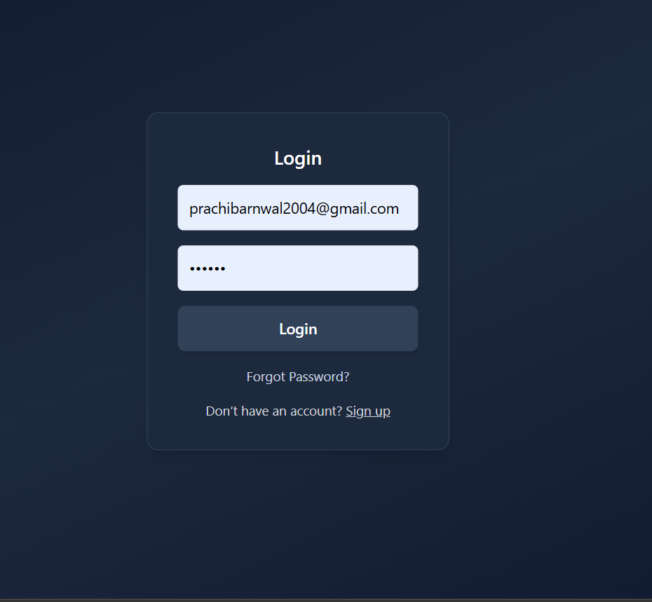

### Signup Page
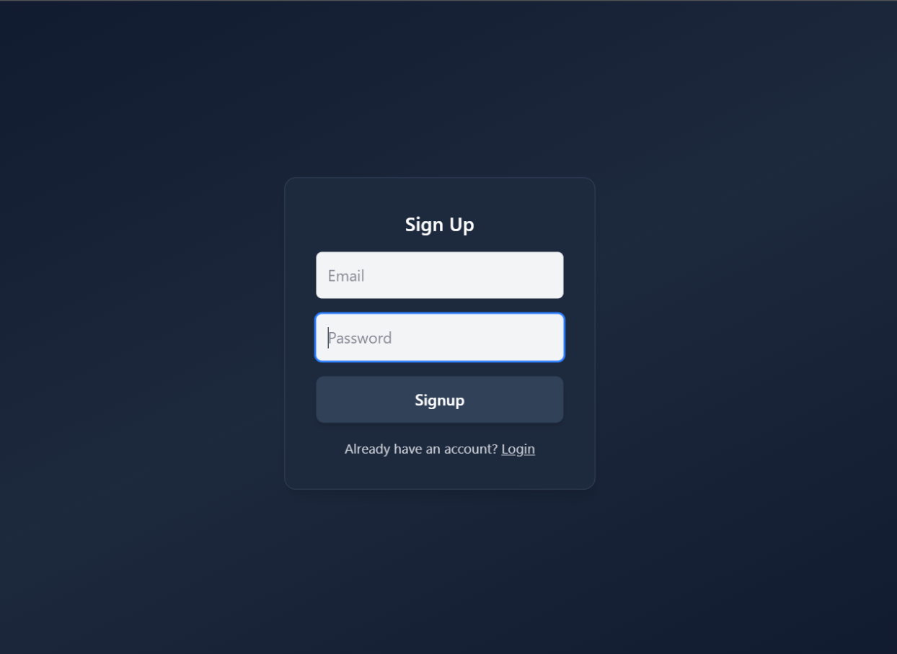

###  Dashboard
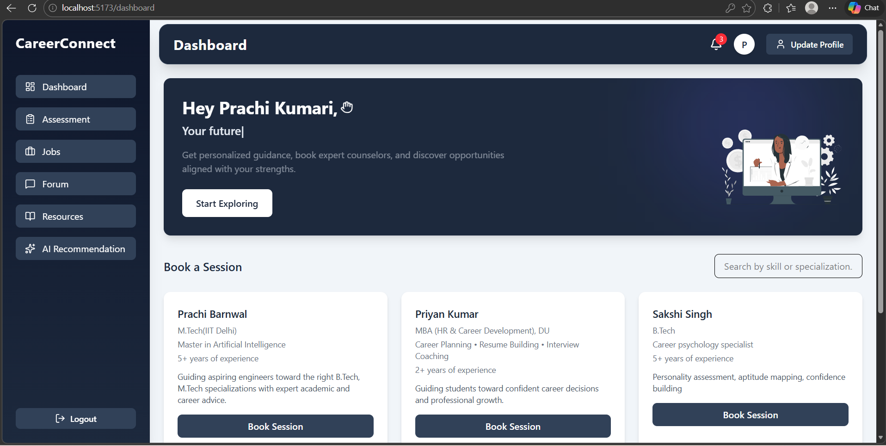

###  Notification Modal
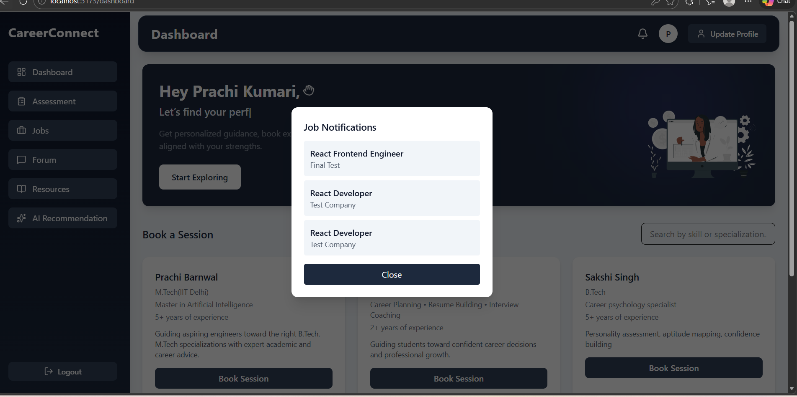

###  Career Assessment
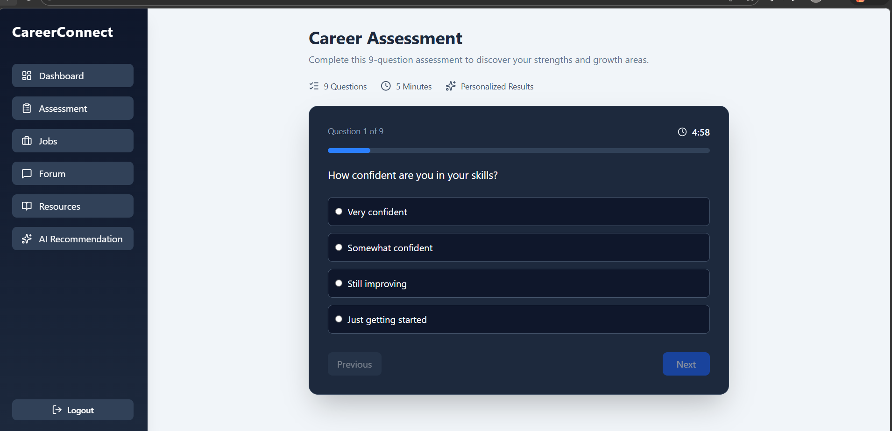

###  Assessment Result
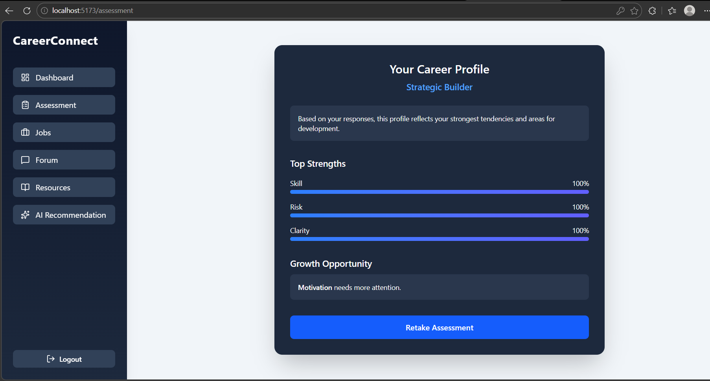

###  Job Page
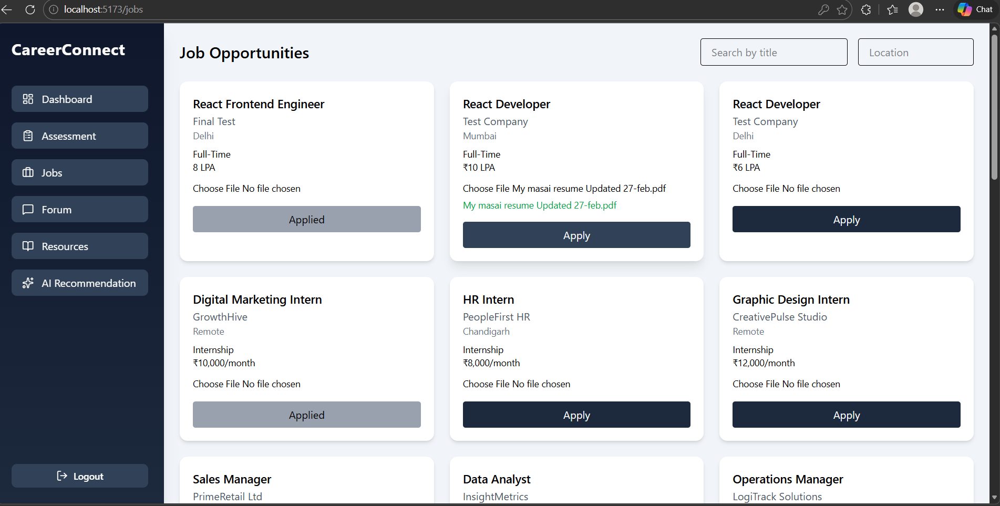

###  Community Forum
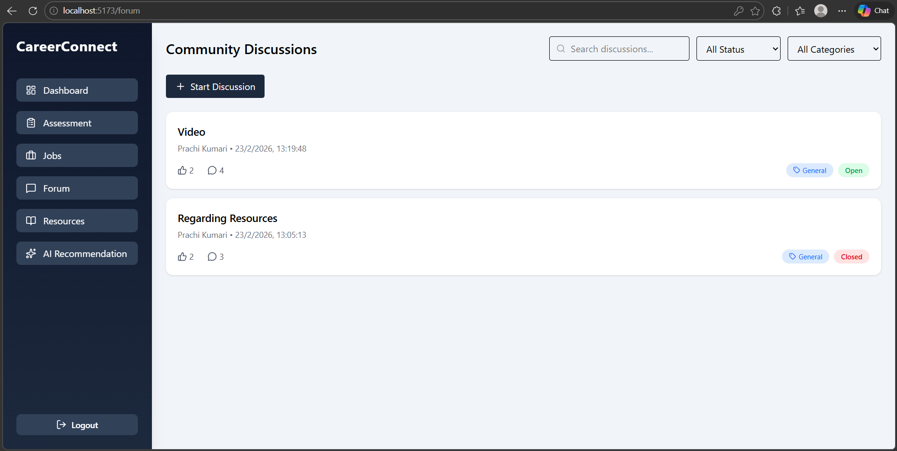

###  Single Forum Post
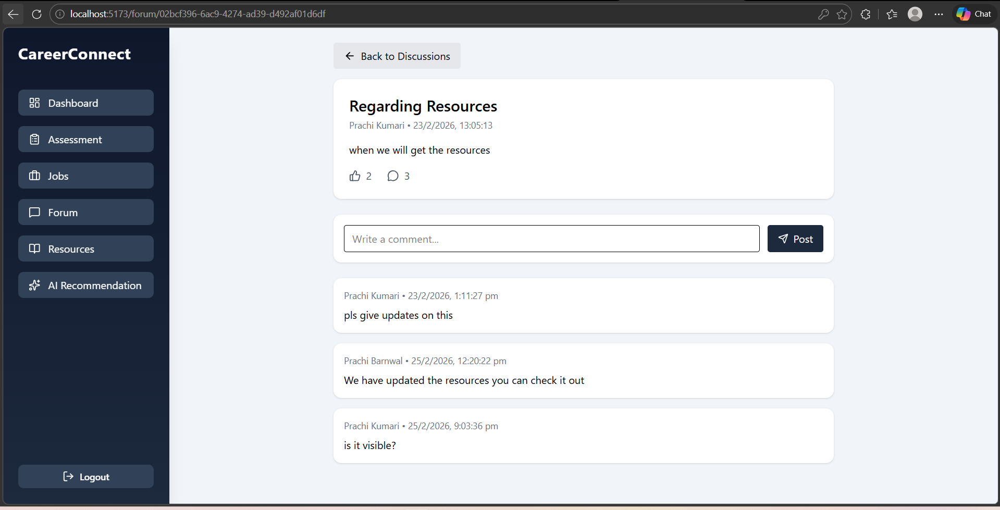

###  Resource Library
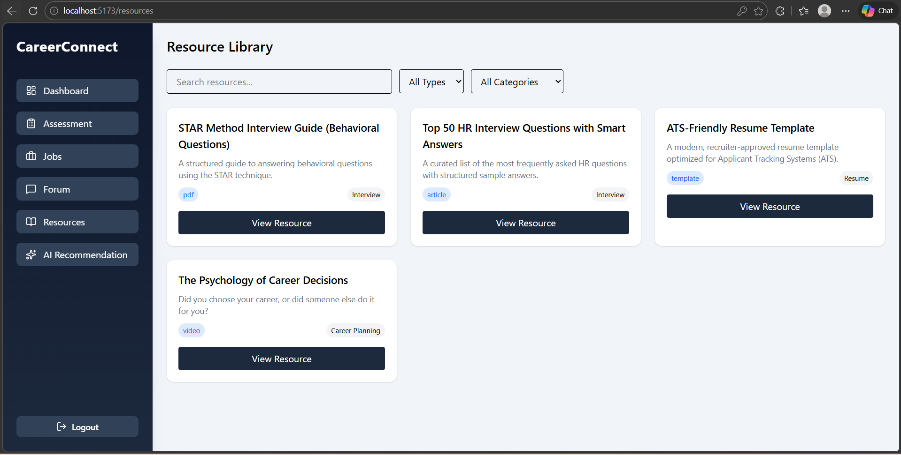

### AI Recommendation
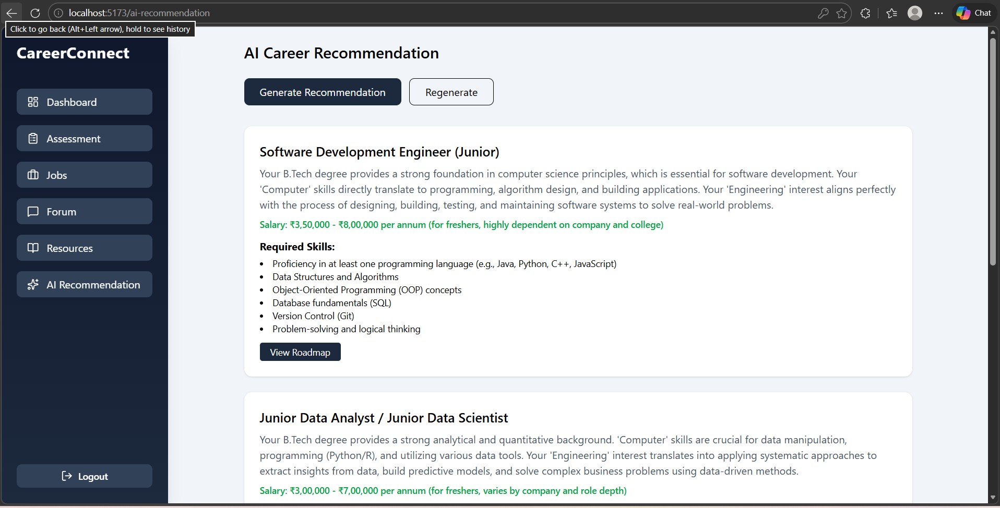

### AI Recommendation Pathmap
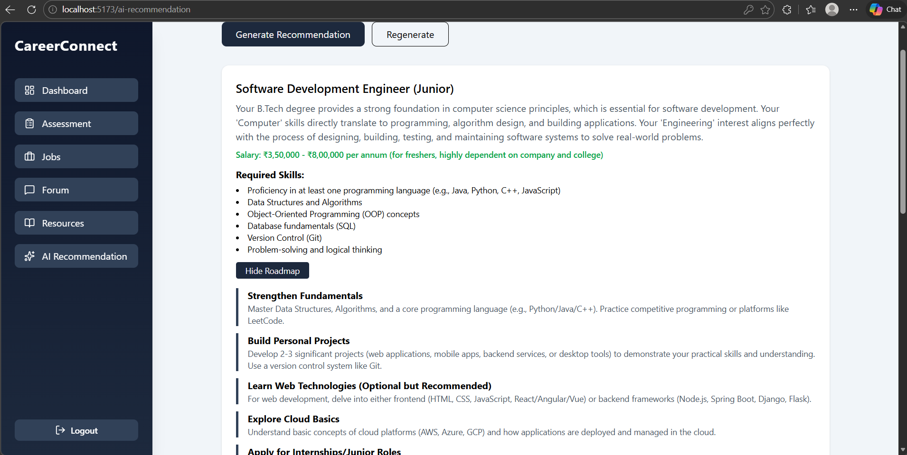

--------------------------------------------------------------------------------------------------
## Video Walkthrough Link
Link : https://drive.google.com/file/d/14JgBlLZ-2CqjMI76et8ITGmlXVdjzYtG/view?usp=sharing

--------------------------------------------------------------------------------------------------
##  Installation & Setup

1. Clone the repository
2. Install dependencies:

```bash
npm install